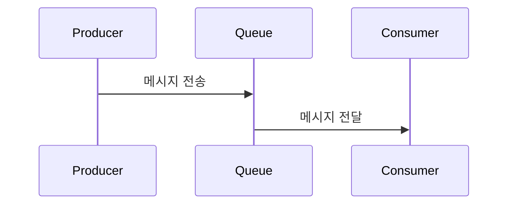

# 메시지 큐(Message Queue)

## 메시지 큐란?
메시지 큐는 **프로세스나 시스템 간에 데이터를 비동기적으로 주고받기 위해 사용하는 통신 방식**입니다. 여기서 "메시지"는 전달하고자 하는 데이터 단위를 의미하고, "큐"는 먼저 들어온 메시지가 먼저 나가는(FIFO, First-In-First-Out) 자료구조를 의미합니다.

---

## 주요 특징

1. **비동기 처리**  
   송신자(Sender)와 수신자(Receiver)가 동시에 동작하지 않아도 메시지를 주고받을 수 있습니다. 송신자는 메시지를 큐에 넣고 바로 다음 작업을 할 수 있습니다.

2. **비동기 통신**  
   시스템 간 결합도를 낮추고, 각자의 속도에 맞춰 독립적으로 동작할 수 있습니다.

3. **신뢰성**  
   메시지는 큐에 안전하게 저장되어, 수신자가 처리할 때까지 보관됩니다.

4. **확장성**  
   여러 수신자가 동시에 메시지를 처리할 수 있어, 시스템 확장에 유리합니다.

---

## 동작 방식

- **Producer(생산자)**: 메시지를 생성해서 큐에 넣는 역할
- **Queue(큐)**: 메시지를 임시로 저장하는 공간
- **Consumer(소비자)**: 큐에서 메시지를 꺼내서 처리하는 역할

---

## 사용 예시

- **비동기 작업 처리**: 이메일 발송, 이미지 변환 등 시간이 오래 걸리는 작업을 큐에 넣고, 백그라운드에서 처리
- **분산 시스템**: 여러 서버가 동시에 메시지를 받아 처리할 때
- **트래픽 버퍼링**: 갑작스러운 요청 폭주 시, 큐에 쌓아두고 천천히 처리

---

## 대표적인 메시지 큐 시스템

- RabbitMQ
- Apache Kafka
- Amazon SQS
- ActiveMQ
- Redis(간단한 큐 기능 제공)

---

## 요약

메시지 큐는 **비동기적이고, 신뢰성 있게, 시스템 간 데이터를 주고받을 수 있게 해주는 중간 매개체**입니다. 대규모 시스템, 마이크로서비스, 분산 환경에서 매우 중요한 역할을 합니다. 