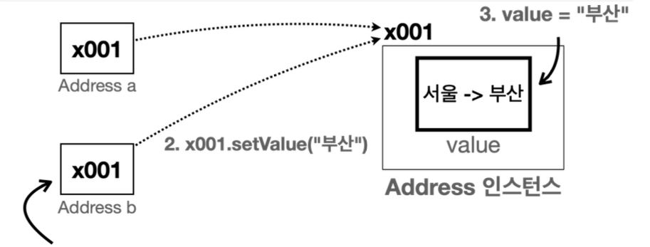

```Java
package lang.immutable.address;

public class RefMain_1 {
    public static void main(String[] args) {
        // 참조형 변수는 하나의 인스턴스를 공유할 수 있다.
        Address a = new Address("서울");
        Address b = a;

        System.out.println("a = " + a);
        System.out.println("b = " + b);

        b.setValue("부산"); // b의 값을 부산으로 변경해야함
        System.out.println("부산 -> b");
        System.out.println("a = " + a); // 사이드 이펙트 발생
        System.out.println("b = " + b);

    }
}
```
위 소스를 그림으로 그리면 다음과 같다.



### 공유 참조와 사이드 이펙트
a,b는 같은 **인스턴스를 참조**하기 때문에 a의 값도 함께 부산으로 변경된 것이다.

#### 출처
김영한 자바 중급 

#### 작성일
2024.04.15